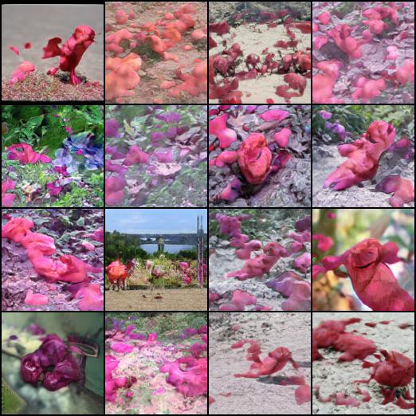
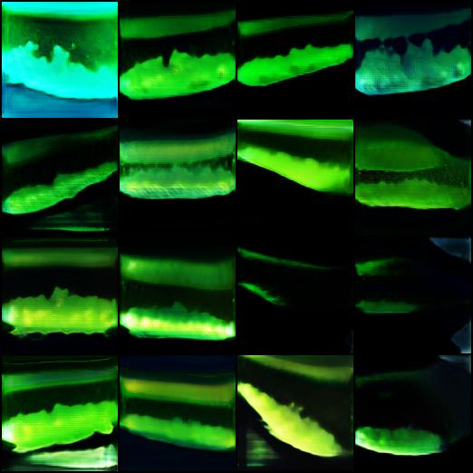
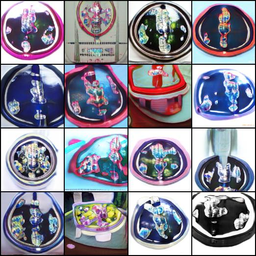

# Expanded Pipeline for Fine-Tuning Class Embeddings compatible with TetrationAI Discriminators

This project builds on the work of Qi Li et al. (2020), "[A cost-effective method for improving and re-purposing large, pre-trained GANs by fine-tuning their class-embeddings](https://github.com/qilimk/biggan-am?tab=readme-ov-file)." This expanded pipeline is designed to work with any image classes, serving as a data-augmentation tool to expand datasets.

## Project Overview

This pipeline is integrated with the `first_demo_main` repository and aims to enhance classifiers by forcing them to recognize patterns across a variety of classes. However, the algorithm currently faces challenges in uniquely identifying classes outside the CIFAR dataset.

## Results and Directory Structure

Results for different hyperparameter configurations can be found in the `final/` directory, while the best generated samples are available in the `samples/` directory.

### Sample Images

Below are some examples of images generated by the model:

- **Generated image of Rose**  
  

- **Generated image of Worm**  
  

- **Roses after hyperparameter tuning - Failed**  
  
